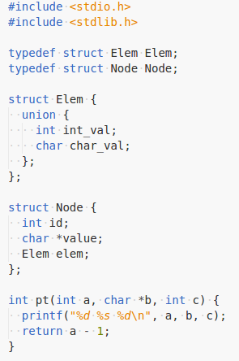

# 语法分析和语义分析

## 语法分析

利用递归下降分析建立符号表和控制流图

部分数据结构 type.h 下定义

```C
// 控制流图的数据结构
// 每一个控制块以一个 label 开头,以一个无条件跳转语句和有条件跳转语句结尾
class Block {
 public:
  Block();

 public:
  // 当前控制块的编号
  int id_;
  // 记录有几个其他控制块指向当前控制块
  int in_deg_;
  // 当前块中所包含的四元式
  std::vector<Instruction> ins_;
  // 无条件跳转或有条件跳转失败的去向
  std::shared_ptr<Block> non_condi_;
  // 有条件跳转成功的去向
  std::shared_ptr<Block> condi_;

 public:
  static int blck_cnt_;
};

// 四元式的数据结构
class Instruction {
 public:
  Instruction();

 public:
  // 对应伪指令类型
  Type ins_;
  // 四元式的编号
  int ord_;
  // 结果域
  std::shared_ptr<ReturnType> des_;
  // 操作数一
  std::shared_ptr<ReturnType> a_;
  // 操作数二
  std::shared_ptr<ReturnType> b_;
};

//用于定义新类型
//不是 struct 便是 union
class PType {
 public:
  PType();

 public:
  // 是否是 struct
  int is_struct_;
  // 结构体或者共联体的长度
  int width_;
  // 类型名
  std::string literal_;
  // 自带链表
  std::shared_ptr<PType> nxt_;
  // 用于指向成员类型
  std::shared_ptr<Identifier> mem_;
};

//用于构建符号表
class Environment {
 public:
  Environment(std::shared_ptr<Environment> pre);

 public:
  // 指向上一层环境符号表
  std::shared_ptr<Environment> pre_;
  // 当前环境下所定义的类型
  std::shared_ptr<PType> types_;
  // 当前环境下所定义的标识符
  std::shared_ptr<Identifier> ids_;
};

// 用于表示所定义的
class Identifier {
 public:
  Identifier(std::shared_ptr<PType> type, int is_var,
             std::shared_ptr<Declarator> a, std::shared_ptr<Declarator> b);

  Identifier();

  static std::shared_ptr<Identifier> cloneIdentifier(
      std::shared_ptr<Identifier> id);

 public:
  // 标识符的名字
  std::string id_;
  // 是变量的话,指针层数
  int level_;
  // 如果是 struct 或 union 的成员变量,记录其偏移量
  int from_;
  // 是变量就为 1 ,是 typedef 的声明就为 0
  int is_var_;
  // 如果是函数的参数,从右向左,1 至 n
  int arg_num_;
  // 标识符可能被定义成数组类型
  std::shared_ptr<Array> array_;
  // 类型
  std::shared_ptr<PType> type_;
  // 自带链表
  std::shared_ptr<Identifier> nxt_;
  // 初始化类型, 包括不初始化 字符串初始化 列表初始化
  int init_type_;
  // 初始化字符串的字面值,输出到 .data 段
  std::string init_str_;
  // 字符串的值
  std::string str_val_;
  // 初始化列表,输出到 .data 段的 .word .bytes
  std::shared_ptr<InitPair> init_list_;
  // 标识符属于哪一层符号表,用于区分全局变量和栈变量
  std::shared_ptr<Environment> env_belong_;
  // 标识符所属 struct 或者 union
  std::shared_ptr<PType> type_belong_;
};

//数组定义信息
class Array {
 public:
  Array();

 public:
  // 数组当前维度信息
  int num_;
  // 数组后面维度乘积
  int mul_;
  // 数组的后面一个维度
  std::shared_ptr<Array> nxt_;
  // 数组的前面一个维度
  std::shared_ptr<Array> pre_;
};

//用于定义初始化列表
class InitPair {
 public:
  InitPair(int idx, int num, const std::string& label);

 public:
  // 处于初始化列表中的下标
  int pos_;
  // 初始化的整数值
  int num_;
  // 初始化的字符串值
  std::string label_;
  // 自带链表
  std::shared_ptr<InitPair> nxt_;
};

// 用于解析声明
class Declarator {
 public:
  Declarator();

 public:
  static std::shared_ptr<Declarator> mergeDecl(std::shared_ptr<Declarator> a,
                                               std::shared_ptr<Declarator> b);

 public:
  // 名
  std::string literal_;
  // 指针层数
  int level_;
  // 自带链表
  std::shared_ptr<Declarator> nxt_;
  // 是否是函数 ()
  int is_func_;
  // 是函数的话,后面带有的参数
  std::shared_ptr<Identifier> args_;
  // 数组的维度
  std::shared_ptr<Array> dim_;
};

// 表达式的运算
class ReturnType {
 public:
  ReturnType();

 public:
  // 类型, 包括 临时变量 数组 常量
  int ret_type_;
  // 是否为左值
  int is_left_;
  // 如果是常量的话,对应的值
  int const_val_;
  // 表达式中有函数的话,对应函数
  std::shared_ptr<Function> func_;
  // 自带链表
  std::shared_ptr<ReturnType> nxt_;
  // 临时变量的类型或实际类型
  std::shared_ptr<Identifier> ref_;
  // 临时变量的编号
  int reg_num_;
  // 在栈中的偏移量
  int sp_offset_;
  // 属于哪一个函数
  std::shared_ptr<Function> belong_;
  // 寄存器的分配
  std::shared_ptr<Register> reg_;
};

// 函数
class Function {
 public:
  Function(std::shared_ptr<PType> type, std::shared_ptr<Declarator> a,
           std::shared_ptr<Declarator> b);

 public:
  // 函数的返回值类型
  std::shared_ptr<PType> type_;
  // 函数的返回类型中的指针层数
  int level_;
  // 记录该函数用到的临时变量
  int tmp_cnt_;
  // 函数名
  std::string id_;
  // 函数的参数表
  std::shared_ptr<Identifier> args_;
  // 自带链表
  std::shared_ptr<Function> nxt_;
  // 函数开头的第一个块
  std::shared_ptr<Block> block_;
  // 函数结束时的最后一个块
  std::shared_ptr<Block> end_;
  // 函数用到的临时变量列表
  std::shared_ptr<ReturnType> regs_;
};
```

递归下降分析的相应函数定义

```C
// 利用词法序列解析生成,符号表和控制流图
void parse();

// 解析类型 标识符 int char void struct union
std::shared_ptr<PType> parseTypeSpecifier(std::shared_ptr<Declarator> defs);

// 解析多个声明 如 int a, b, c;
std::shared_ptr<Declarator> parseDeclarators();

// 解析单个声明 如 int a, b, c; 中的 b
// 还包括函数和数组
std::shared_ptr<Declarator> parseDeclarator();

// 用于解析 int *a(); 中 *a 指出指针层数和标识符
std::shared_ptr<Declarator> parsePlainDeclarator();

// 解析函数参数
std::shared_ptr<Identifier> parseParameters();

// 解析 int a[10][2]; 中的 [10][2] 指出数组的维度信息
std::shared_ptr<Array> parseArray();

// 解析常量表达式, 所解析的表达式类型必须为常量否则报错
std::shared_ptr<ReturnType> parseConstExpr();

// 解析 || 表达式
std::shared_ptr<ReturnType> parseLogicOrExpr();

// 解析 && 表达式
std::shared_ptr<ReturnType> parseLogicAndExpr();

// 解析 & 表达式
std::shared_ptr<ReturnType> parseAndExpr();

// 解析 ^ 表达式
std::shared_ptr<ReturnType> parseXorExpr();

// 解析 | 表达式
std::shared_ptr<ReturnType> parseOrExpr();

// 解析 == 或 != 表达式
std::shared_ptr<ReturnType> parseEqualityExpr();

// 解析 < 或 > 或 <= 或 >= 表达式
std::shared_ptr<ReturnType> parseRelationalExpr();

// 解析 << 或 >> 表达式
std::shared_ptr<ReturnType> parseShiftExpr();

// 解析 + 或 - 表达式
std::shared_ptr<ReturnType> parseAdditiveExpr();

// 解析 * / % 表达式
std::shared_ptr<ReturnType> parseMultiExpr();

// 解析 () 表达式
std::shared_ptr<ReturnType> parseCastExpr();

// 解析表达式序列 int a = 1 + 3, b = 2 + 4;
std::shared_ptr<ReturnType> parseExpr();

// 解析赋值表达式 = 或 -= 或 *= 或 /= 等等
std::shared_ptr<ReturnType> parseAssignExpr();

// 解析前缀 ++ 或 -- 表达式
std::shared_ptr<ReturnType> parseUnaryExpr();

// 解析后缀表达式
// int a(int b, int c); 中 ( ) 的内容
// int a[100]; a[100-10] = 10; 中 [ ] 的内容
// Node node; node.elem = 1; 中 . 运算符
// Node *node ... node->elem = 1; 中 -> 运算符
// 后缀 ++ 或 --
std::shared_ptr<ReturnType> parsePostfix(std::shared_ptr<ReturnType> th);

// 解析函数参数
std::shared_ptr<ReturnType> parseArguments(std::shared_ptr<Function> func);

// 解析后缀表达式
std::shared_ptr<ReturnType> parsePostfixExpr();

// 解析标识符 整数常量 字符串常量 字符常量
std::shared_ptr<ReturnType> parsePrimaryExpr();

// 解析模块 { } 中部分
void parseCompoundStmt(std::shared_ptr<Block> iter_strt,
                         std::shared_ptr<Block> iter_end);

// 解析初始化声明 int a = 0 + 1, b = 1;
void parseInitDeclarators(std::shared_ptr<PType> th,
                            std::shared_ptr<Declarator> def);

// 解析 int a = 0 + 1; 中的 0 + 1 部分
void parseInitializer(std::shared_ptr<Identifier> var);

// 解析控制语句模块
void parseStmt(std::shared_ptr<Block> iter_strt,
                 std::shared_ptr<Block> iter_end);
```

## 语义分析

在递归下降分析的过程中,针对每个控制流图,生成相应四元式

四元式的操作数类型

```C
// +
INS_ADD
// -
INS_SUB
// *
INS_MUL
// /
INS_DIV
// |
INS_OR
// ^
INS_XOR
// &
INS_AND
// <<
INS_SLLV
// >>
INS_SRLV
// !=
INS_SNE
// ==
INS_SEQ
// >
INS_SGT
// <
INS_SLT
// >=
INS_SGE
// <=
INS_SLE
// %
INS_REM
// - 取负
INS_NEG
// 不等 0 时跳转到相应分支
INS_BNEZ
// 等于 0 时跳转到相应分支
INS_BEQZ
// 函数参数入栈
INS_PARA
// 函数调用
INS_CALL
// 输出整数
INS_PRINT_INT
// 输出字符串
INS_PRINT_STRING
// malloc 函数
INS_MALLOC
// getchar 函数
INS_GETCHAR
// putchar 函数
INS_PUTCHAR
// 加载值操作
INS_MOVE
// 逻辑非
INS_NOT
// 加载地址
INS_LD_ADDR
// 函数返回
INS_RET
// exit 函数
INS_HALT
// 向数组元素写
INS_ARRAY_WRITE
// 从数组元素读
INS_ARRAY_READ
// 小于等于则跳转
INS_BLE
// 大于等于则跳转
INS_BGE
// 小于则跳转
INS_BLT
// 大于则跳转
INS_BGT
// 不相等则跳转
INS_BNE
// 相等则跳转
INS_BEQ
```

## 测试

对 test/test.c 文件进行测试



输出的部分四元式序列,每个控制块中会由相应的四元式

每个函数中的控制块之间的关系相当于一个二叉树

以下仅以顺序产生的部分四元式输出

```C
// 序号 操作数类型 左操作数(是否存在) 右操作数(是否存在) 结果域(否存在)
1: Type::INS_MOVE 1 0 1
2: Type::INS_MOVE 1 0 1
3: Type::INS_ARRAY_READ 1 0 1
4: Type::INS_BNEZ 1 0 0
5: Type::INS_MOVE 1 0 1
6: Type::INS_ARRAY_READ 1 0 1
7: Type::INS_SEQ 1 1 1
8: Type::INS_BNEZ 1 0 0
9: Type::INS_ADD 1 1 1
10: Type::INS_ARRAY_READ 1 0 1
11: Type::INS_SEQ 1 1 1
12: Type::INS_BNEZ 1 0 0
13: Type::INS_ADD 1 1 1
14: Type::INS_MOVE 1 0 1
15: Type::INS_MOVE 1 0 1
16: Type::INS_MUL 1 1 1
17: Type::INS_ADD 1 1 1
18: Type::INS_ARRAY_READ 1 0 1
19: Type::INS_PRINT_INT 1 0 0
20: Type::INS_ADD 1 1 1
21: Type::INS_ARRAY_READ 1 0 1
22: Type::INS_SEQ 1 1 1
23: Type::INS_BNEZ 1 0 0
24: Type::INS_ADD 1 1 1
25: Type::INS_MOVE 1 0 1
26: Type::INS_MOVE 1 0 1
27: Type::INS_MUL 1 1 1
28: Type::INS_ADD 1 1 1
29: Type::INS_ARRAY_READ 1 0 1
```